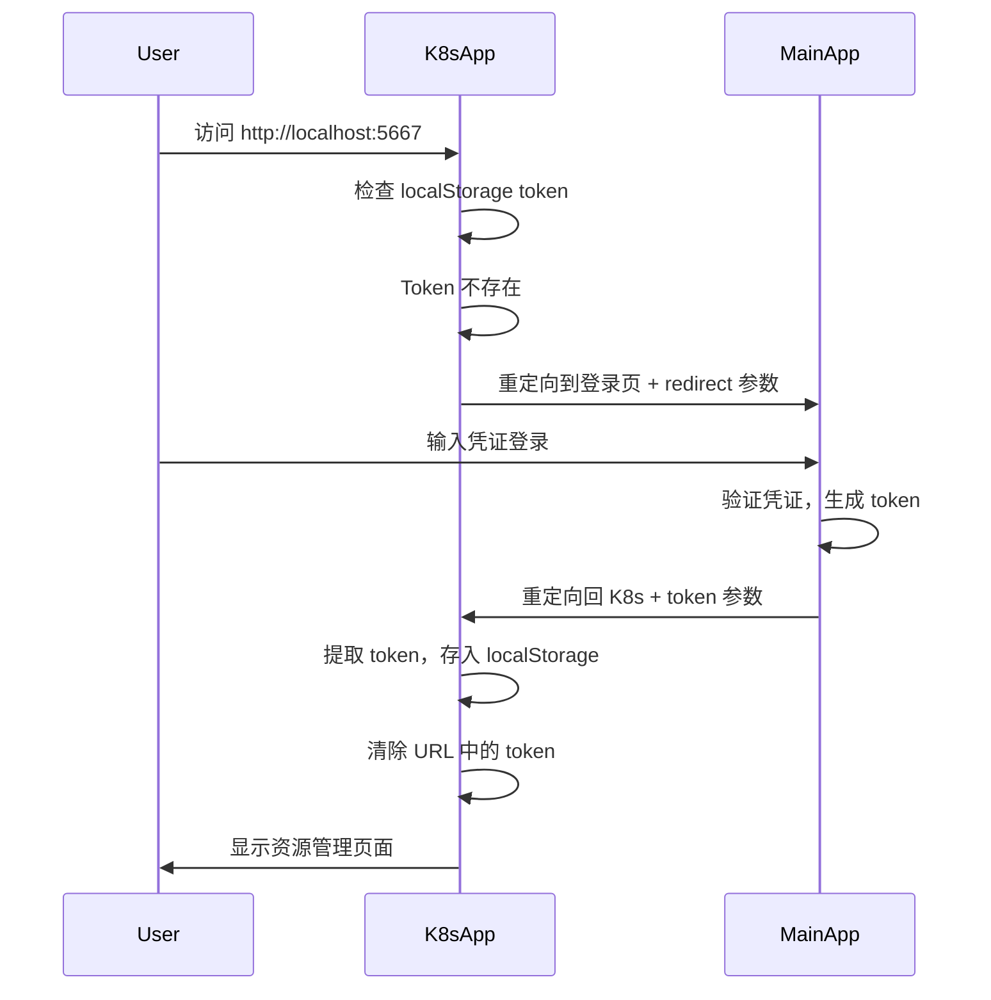
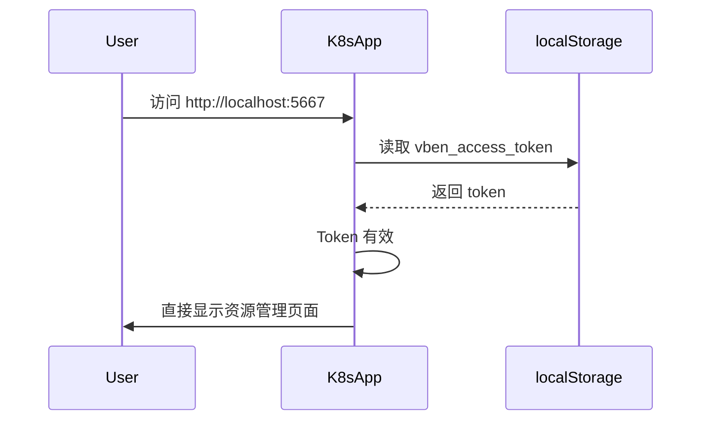
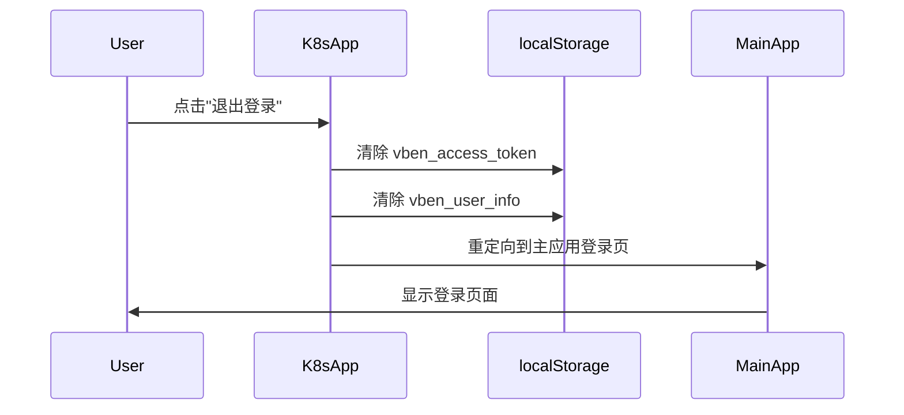

# K8s 应用统一认证指南

本文档说明 K8s 独立应用与主应用之间的统一认证机制。

## 认证架构

### 系统概览

```text
┌─────────────────┐         ┌──────────────────┐
│   主应用        │         │  K8s 独立应用    │
│  (Port 5666)    │◄───────►│  (Port 5667)     │
│                 │  Token   │                  │
│  - 登录页面     │  共享    │  - 资源管理      │
│  - 用户管理     │         │  - 无登录页面    │
│  - Token 签发   │         │  - Token 验证    │
└─────────────────┘         └──────────────────┘
          │                          │
          └──────────┬───────────────┘
                     │
              localStorage
           (vben_access_token)
```

### 认证流程

#### 1. 首次访问流程



#### 2. 已登录访问流程



#### 3. 登出流程



## 代码实现

### 1. K8s 应用认证工具 (apps/web-k8s/src/utils/auth.ts)

```typescript
const TOKEN_KEY = 'vben_access_token';
const USER_INFO_KEY = 'vben_user_info';

// 获取 Token
export function getToken(): string | null {
  return localStorage.getItem(TOKEN_KEY);
}

// 设置 Token
export function setToken(token: string) {
  localStorage.setItem(TOKEN_KEY, token);
}

// 从 URL 参数获取 Token
export function getTokenFromUrl(): string | null {
  const urlParams = new URLSearchParams(window.location.search);
  return urlParams.get('token');
}

// 处理认证回调
export function handleAuthCallback(): boolean {
  const tokenFromUrl = getTokenFromUrl();
  if (tokenFromUrl) {
    setToken(tokenFromUrl);
    // 清除 URL 中的 token 参数
    const url = new URL(window.location.href);
    url.searchParams.delete('token');
    window.history.replaceState({}, '', url.toString());
    return true;
  }
  return isAuthenticated();
}

// 重定向到主应用登录页
export function redirectToLogin() {
  const mainAppUrl = import.meta.env.VITE_MAIN_APP_URL || 'http://localhost:5666';
  const currentUrl = window.location.href;
  window.location.href = `${mainAppUrl}/auth/login?redirect=${encodeURIComponent(currentUrl)}`;
}

// 清除认证信息
export function clearAuth() {
  removeToken();
  removeUserInfo();
}
```

### 2. K8s 应用路由守卫 (apps/web-k8s/src/router/index.ts)

```typescript
router.beforeEach((to, from, next) => {
  // 设置页面标题
  if (to.meta.title) {
    document.title = `${to.meta.title} - ${import.meta.env.VITE_APP_TITLE}`;
  }

  // 处理认证回调
  handleAuthCallback();

  // 检查是否需要认证
  const requireAuth = to.meta.requireAuth !== false;

  if (requireAuth && !isAuthenticated()) {
    console.warn('未登录，重定向到主应用登录页');
    redirectToLogin();
    return;
  }

  next();
});
```

### 3. 主应用登录逻辑 (apps/web-antd/src/store/auth.ts)

```typescript
async function authLogin(params: Recordable<any>, onSuccess?: () => Promise<void> | void) {
  const { accessToken } = await loginApi(params);

  if (accessToken) {
    accessStore.setAccessToken(accessToken);

    // 获取用户信息
    const [userInfo, accessCodes] = await Promise.all([
      fetchUserInfo(),
      getAccessCodesApi(),
    ]);

    // 检查是否有重定向 URL（从 K8s 应用跳转过来）
    const redirectUrl = router.currentRoute.value.query.redirect as string;

    if (redirectUrl && redirectUrl.startsWith('http')) {
      // 如果是外部 URL（子应用），带上 token 重定向
      window.location.href = `${redirectUrl}${redirectUrl.includes('?') ? '&' : '?'}token=${accessToken}`;
    } else {
      // 正常的内部路由跳转
      onSuccess
        ? await onSuccess?.()
        : await router.push(redirectUrl || userInfo.homePath || defaultHomePath);
    }
  }
}
```

### 4. K8s 应用登出按钮 (apps/web-k8s/src/App.vue)

```vue
<script setup lang="ts">
import { clearAuth, getUserInfo } from './utils/auth';
import { Dropdown, message } from 'ant-design-vue';
import { LogoutOutlined, UserOutlined } from '@ant-design/icons-vue';

// 获取用户信息
const userInfo = computed(() => getUserInfo());

// 登出
function handleLogout() {
  clearAuth();
  message.success('已登出');
  const mainAppUrl = import.meta.env.VITE_MAIN_APP_URL || 'http://localhost:5666';
  window.location.href = `${mainAppUrl}/auth/login`;
}

// 用户菜单项
const userMenuItems = [
  {
    key: 'logout',
    label: '退出登录',
    icon: LogoutOutlined,
  },
];
</script>

<template>
  <Dropdown :menu="{ items: userMenuItems, onClick: handleUserMenuClick }">
    <Button type="link" style="color: white">
      <UserOutlined />
      <span>{{ userInfo?.realName || userInfo?.username || '用户' }}</span>
    </Button>
  </Dropdown>
</template>
```

## 环境配置

### K8s 应用环境变量 (apps/web-k8s/.env.development)

```bash
# 应用标题
VITE_APP_TITLE=K8s Management Platform

# 应用端口
VITE_PORT=5667

# 主应用 URL（用于认证重定向）
VITE_MAIN_APP_URL=http://localhost:5666

# API 地址
VITE_GLOB_API_URL=/api

# 路由模式
VITE_ROUTER_HISTORY=hash

# Base URL
VITE_BASE=/
```

## Token 共享机制

### localStorage 键名约定

两个应用使用相同的 localStorage 键名来共享认证状态：

- **Token 键**: `vben_access_token`
- **用户信息键**: `vben_user_info`

### 安全考虑

1. **Token 传递**
   - Token 仅在 URL 中短暂存在
   - 接收后立即从 URL 清除
   - 使用 `window.history.replaceState` 避免历史记录泄露

2. **Token 验证**
   - 每个路由跳转都会检查 token 有效性
   - 无效 token 自动重定向到登录页

3. **跨域限制**
   - 仅允许重定向到配置的主应用 URL
   - 使用 `startsWith('http')` 检查外部 URL

## 测试场景

### 1. 首次访问测试

```bash
# 步骤
1. 清除浏览器 localStorage
2. 访问 http://localhost:5667
3. 应自动重定向到 http://localhost:5666/auth/login?redirect=http://localhost:5667
4. 在主应用登录（用户名: vben, 密码: 123456）
5. 登录成功后自动跳回 K8s 应用
6. 验证 localStorage 中存在 vben_access_token

# 预期结果
✅ 能够正常访问 K8s 应用
✅ URL 中不包含 token 参数
✅ 顶部导航显示用户名
```

### 2. 已登录访问测试

```bash
# 步骤
1. 在主应用登录
2. 直接访问 http://localhost:5667
3. 应直接显示 K8s 应用，无需再次登录

# 预期结果
✅ 直接进入 K8s 应用
✅ 显示用户信息
```

### 3. 登出测试

```bash
# 步骤
1. 在 K8s 应用中点击用户下拉菜单
2. 点击"退出登录"
3. 应重定向到主应用登录页
4. 验证 localStorage 已清空

# 预期结果
✅ localStorage 中 token 被清除
✅ 重定向到主应用登录页
✅ 再次访问 K8s 应用需要重新登录
```

### 4. Token 过期测试

```bash
# 步骤
1. 在 localStorage 中修改 token 为无效值
2. 刷新 K8s 应用页面
3. 应重定向到登录页

# 预期结果
✅ 检测到无效 token
✅ 自动重定向到登录页
```

## 启动应用

### 同时启动两个应用（推荐）

```bash
# 终端 1: 启动主应用
make dev-antd
# 访问: http://localhost:5666

# 终端 2: 启动 K8s 应用
make dev-k8s
# 访问: http://localhost:5667
```

### 仅启动 K8s 应用

```bash
# 需要确保主应用可访问（用于认证重定向）
make dev-k8s
```

## 故障排查

### 问题 1: 无限重定向循环

**原因**: Token 无法正确存储或读取

**解决**:

```bash
# 1. 检查 localStorage
localStorage.getItem('vben_access_token')

# 2. 检查浏览器控制台错误
# 3. 清除所有 localStorage
localStorage.clear()

# 4. 重新登录
```

### 问题 2: 登录后回调失败

**原因**: redirect URL 编码问题

**解决**:

```typescript
// 检查 URL 参数
const params = new URLSearchParams(window.location.search);
console.log('redirect:', params.get('redirect'));
console.log('token:', params.get('token'));
```

### 问题 3: 用户信息不显示

**原因**: userInfo 未正确存储

**解决**:

```bash
# 检查 localStorage
localStorage.getItem('vben_user_info')

# 在主应用登录后，K8s 应用需要从主应用获取用户信息
# 或者在登录回调时同时传递用户信息
```

## 扩展功能

### 添加刷新 Token 机制

```typescript
// apps/web-k8s/src/utils/auth.ts
export async function refreshToken(): Promise<boolean> {
  try {
    const token = getToken();
    if (!token) return false;

    // 调用刷新 token API
    const response = await fetch('/api/auth/refresh', {
      method: 'POST',
      headers: {
        'Authorization': `Bearer ${token}`,
      },
    });

    const { accessToken } = await response.json();
    if (accessToken) {
      setToken(accessToken);
      return true;
    }
  } catch (error) {
    console.error('Token refresh failed:', error);
  }
  return false;
}
```

### 添加 Token 过期检测

```typescript
// apps/web-k8s/src/router/index.ts
router.beforeEach(async (to, from, next) => {
  handleAuthCallback();

  const requireAuth = to.meta.requireAuth !== false;

  if (requireAuth) {
    if (!isAuthenticated()) {
      redirectToLogin();
      return;
    }

    // 检查 token 是否即将过期
    const token = getToken();
    if (isTokenExpiringSoon(token)) {
      await refreshToken();
    }
  }

  next();
});
```

## 最佳实践

1. **安全性**
   - 使用 HTTPS 在生产环境
   - Token 设置合理的过期时间
   - 实现 refresh token 机制

2. **用户体验**
   - 在 token 过期前自动刷新
   - 提供友好的错误提示
   - 保持登录状态持久化

3. **代码组织**
   - 认证逻辑集中在 utils/auth.ts
   - 路由守卫统一处理认证检查
   - 使用环境变量配置 URL

4. **测试**
   - 测试所有认证流程
   - 验证安全性
   - 检查错误处理

## 参考文档

- [主应用认证系统](apps/web-antd/src/store/auth.ts)
- [K8s 应用路由配置](apps/web-k8s/src/router/index.ts)
- [环境配置指南](ENVIRONMENT_CONFIGURATION.md)
- [K8s 应用启动指南](START_K8S_APP.md)
